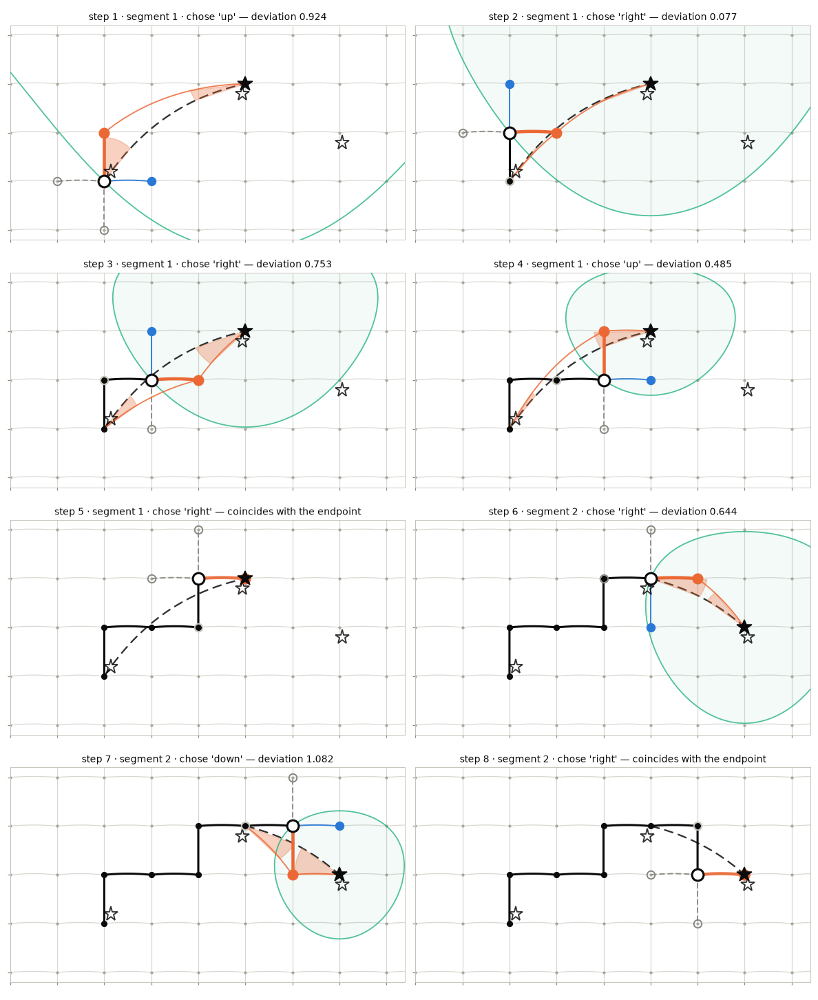

# How the section-tracing algorithm works

`sectionate` turns a handful of geographic waypoints into a *grid-consistent* section: a
chain of vorticity-point ("q-point") corners that follows the grid's own C-grid faces and
approximates the great circle through the waypoints. This page walks through that algorithm
one iteration at a time on a small synthetic grid.

Everything below is the single-tile, `curve="great circle"` case, which is the default. The
entry point is:

```python
i_c, j_c, lons_c, lats_c = sectionate.grid_section(grid, lons, lats)
```

`grid_section` reads the grid's topology, then hands each consecutive pair of waypoints to a
walk:

| stage | what it does |
|---|---|
| `grid_section` | reads corner coordinates and builds the topology-aware neighbour maps |
| `create_section_composite` | loops over consecutive waypoint pairs and stitches the segments |
| `infer_grid_path_from_geo` | checks the segment spans less than 180°, then snaps both waypoints to their nearest corners |
| `infer_grid_path` | **the walk** — steps from corner to corner until it reaches the endpoint |

## The walk, one step at a time

The animation traces a two-segment section across three waypoints on a coarse global grid
(corners every 15° of longitude and 10° of latitude, periodic in X, walled in Y). It opens by
placing each requested waypoint and the grid corner it snaps to, then takes eight steps.

```{raw} html
<video controls loop muted playsinline preload="metadata"
       style="width:100%;max-width:900px;height:auto;border:1px solid #e1e0d9;border-radius:4px">
  <source src="_static/algorithm/walk.mp4" type="video/mp4">
  Your browser cannot play this video.
  <a href="_static/algorithm/walk.mp4">Download it instead.</a>
</video>
```

Each iteration plays out in three beats:

1. **probe** — look up all four neighbours of the current corner in the neighbour maps, and
   discard the ones that are not legal moves;
2. **admit** — draw the *admission circle* and keep only the neighbours that get strictly
   closer to the endpoint;
3. **commit** — among those, step to the one closest to the target great circle, and shade
   the two angles whose sum is that measure of closeness.

## One step in detail

Each iteration of `infer_grid_path` applies three rules in order.

### 1. Enumerate the four neighbours, and drop the illegal ones

The walk never computes `i+1`. It asks the neighbour maps, which are built once by
`gridutils.build_neighbor_maps` and encode the grid's whole topology:

```python
neighbors = [
    neighbor("right", f, j, i),
    neighbor("left",  f, j, i),
    neighbor("down",  f, j, i),
    neighbor("up",    f, j, i),
]
```

Two of those four can be illegal, and both are handled by one small set, `skip = {here, prev}`:

- **a wall.** `build_neighbor_maps` represents an unconnected edge by making the point its own
  neighbour, so a wall is simply a neighbour equal to the current point. On this grid the Y
  axis uses `extend` padding, so the top and bottom corner rows have no neighbour beyond them.
- **the corner we just came from.** Excluding it is what keeps the walk from oscillating.

The probe order — `right`, `left`, `down`, `up` — matters in exactly one place: the endpoint
short-circuit below takes the *first* neighbour it finds coinciding with the endpoint.

### 2. Admit only the neighbours that make progress

`progress` is the geodesic distance from a point to the segment's endpoint, in metres:

```python
def progress(lon, lat):
    return distance_on_unit_sphere(lon, lat, lon2, lat2)
```

Note this is the *straight-line* distance to the target, not the length of path still to be
walked — the staircase the walk actually takes is longer.

A neighbour is admitted only if it is **strictly closer** than where we already stand. Because
the test compares every candidate against one number — the current point's own distance — it
has an exact geometric picture: the circle centred on the endpoint that passes through the
current corner. Everything strictly inside is admitted; everything outside is rejected. That
is the **admission circle** in the animation, and watching it shrink is watching the walk
converge.

This is also what drives the walk to converge: in the ordinary case each step strictly reduces
the remaining distance, so it cannot circle back. Two deliberate exceptions keep that from
being an absolute guarantee — a neighbour that is the *same physical point* reached by a
different index (the twin corners that exist along a fold seam) is admitted even though it
closes no distance, and if nothing at all is admissible the walk falls back to the nearest
legal neighbour, which may move away. `infer_grid_path` therefore also carries a hard step
budget and raises rather than looping forever.

### 3. Among the admitted, take the one closest to the great circle

`progress` narrows the field but does not pick a winner — usually two neighbours are admitted,
one stepping east and one stepping north. `deviation` breaks that tie by measuring how far a
candidate lies off the great circle joining the two endpoints:

```python
def deviation(lon, lat):
    return (spherical_angle(lon2, lat2, lon1, lat1, lon, lat)
            + spherical_angle(lon1, lat1, lon2, lat2, lon, lat))
```

It is a sum of **two** angles, in radians: the angle subtended at the endpoint between the
directions to the start and to the candidate, plus its twin measured at the start. Those are
the two shaded wedges in the animation, and the panel spells out their sum. `deviation` is zero
exactly on the arc between the endpoints and grows as a candidate strays to either side.

The symmetry is not decoration. Because the measure treats the two endpoints identically, the
traced path does not depend on which end you start from — listing a section's waypoints
backwards gives the same corners in reverse, a property the test suite pins down directly.

Two details finish the rule:

- **near-ties are broken by index.** Candidates whose deviation is within
  `WALK_DEVIATION_ATOL` (1e-9 radians) of the best are treated as tied, and the one with the
  lowest `(face, j, i)` wins. Without this, a genuine geometric tie would resolve differently
  on different platforms, because it would come down to floating-point noise.
- **arriving is special-cased.** If any legal neighbour coincides with the endpoint — within
  `COINCIDENT_TOLERANCE_M`, one millimetre — the walk steps onto it immediately and never
  evaluates `deviation` at all. That matters because `deviation` *at* the endpoint is
  degenerate: the arc from the endpoint to itself has no direction. Steps 5 and 8 in the
  animation are these arrivals, and their metric columns are blank because the algorithm
  genuinely does not compute them.

## Why the neighbour maps carry the topology

Nothing in the three rules above knows what kind of grid it is walking on. That is the point
of routing every step through `build_neighbor_maps`: the maps are built once by padding
index-valued arrays with `xgcm` and reading back the halos, so whatever the grid's metadata
encodes — a periodic wrap, a fill or extend wall, a bipolar north fold, or the face
connections of a multi-tile grid — arrives as ordinary neighbour entries.

A periodic wrap is the simplest illustration. On this grid the `right` neighbour of the last
column, `i = 23`, simply *is* `i = 0`: geographically an ordinary step east, in index space a
jump across the whole array. The walk needs no case for it and contains no wrap-around
arithmetic. A wall is handled by the same mechanism from the other direction — an unconnected
edge is encoded as a corner being its own neighbour, which the `skip` set already discards.

This is also why `grid_section` has no `topology` keyword: there is nothing for a caller to
declare, and no way for a caller to declare it wrongly.

The grey mesh drawn behind the corners in the animation comes from those same maps rather than
from index arithmetic, so it is literally the graph the walk is allowed to move on — a wall
shows up in it as a missing edge, and a seam-crossing face as a real one.

Grids with folds, caps and cuts push this much further, and are where the payoff is — see
[notebook 4](examples/4_sections_on_global_tripolar_grid.ipynb) for a tripolar grid with a
bipolar north fold and [notebook 5](examples/5_MOC_transports_ECCOv4r4.ipynb) for the 13-tile
ECCO lat-lon-cap grid, where a section crosses tile seams that are rotated relative to one
another.

## Reproducing the traced path

The grid in the animation is small enough to build inline, with no data files:

```python
import numpy as np
import xarray as xr
import xgcm
from sectionate import grid_section

# A coarse global C-grid: corners every 15 degrees of longitude and 10 of
# latitude, periodic in X and walled in Y.
lon_c = np.arange(0.0, 360.0, 15.0)
lat_c = np.arange(-80.0, 81.0, 10.0)
LON_C, LAT_C = np.meshgrid(lon_c, lat_c)
# 'right' staggering: tracer cell (j, i) has its upper-right corner at
# (LON_C[j, i], LAT_C[j, i]), so cell centers sit half a cell to the south-west.
LON_H, LAT_H = np.meshgrid(lon_c - 7.5, lat_c - 5.0)
ny, nx = LON_C.shape

ds = xr.Dataset(coords={
    "xq": np.arange(nx), "yq": np.arange(ny),
    "xh": np.arange(nx) + 0.5, "yh": np.arange(ny) + 0.5,
    "geolon_c": (("yq", "xq"), LON_C), "geolat_c": (("yq", "xq"), LAT_C),
    "geolon": (("yh", "xh"), LON_H), "geolat": (("yh", "xh"), LAT_H),
})
grid = xgcm.Grid(
    ds,
    coords={"X": {"center": "xh", "right": "xq"},
            "Y": {"center": "yh", "right": "yq"}},
    padding={"X": "periodic", "Y": "extend"},
    autoparse_metadata=False,
)

i_c, j_c, lons_c, lats_c = grid_section(
    grid, [62.0, 104.0, 136.0], [42.0, 58.0, 48.0]
)
print("i_c  ", i_c)
print("j_c  ", j_c)
```

```text
i_c   [4 4 5 6 6 7 8 8 9]
j_c   [12 13 13 13 14 14 14 13 13]
```

Nine corners for eight steps, and reading the two together shows the staircase: `i` advances
while `j` holds, then `j` advances while `i` holds. Note also that the two segments share the
corner the middle waypoint snapped to — `(i=7, j=14)`, which appears exactly once:
`create_section_composite` drops each segment's final point so that shared corner is not
duplicated.

## From corners to transports

The corner chain is not the end goal — it is the scaffolding for computing transports. Each
*consecutive pair* of corners spans one C-grid velocity face, so `N` corners define up to
`N-1` faces, and `transports.uvindices_from_qindices` converts the chain into those velocity
indices:

```python
from sectionate.transports import uvindices_from_qindices

uv = uvindices_from_qindices(grid, i_c, j_c)
# uv["var"] is "U" or "V" per face; uv["i"], uv["j"] index that velocity;
# uv["Xinc"], uv["Yinc"] record the direction of travel through each face.
```

Whether a face is a `U` or a `V` point falls straight out of which way the step went, though
the pairing is the opposite of the one people usually guess. A step in `i` runs between two
corners at the same latitude index, so the edge it traverses is *zonal* — and the flux across
a zonal edge is meridional, a `V` point. A step in `j` traverses a meridional edge, crossed by
`U`. The corner-to-velocity index offset depends on where vorticity sits in the grid's
staggering (`outer`, `right` or `left`) and is read from the grid rather than assumed.

"Up to" `N-1`, because a consecutive pair that resolves to the same physical point — the twin
corners of a seam again — spans no cell and carries no flux, so it emits no face at all.

`transports.convergent_transport` then accumulates the signed normal transport through those
faces. For a **closed** section it works out the traversal orientation and signs everything so
that positive means *into* the enclosed region; for an **open** section there is no inside, so
it falls back to a left-of-transect convention and warns.

See [notebook 2](examples/2_OSNAP_transports_CM4p25.ipynb) for transports through an open
section and [notebook 3](examples/3_Labrador_convergence_CM4p25.ipynb) for convergence into a
closed one.

## Every step at a glance

Each panel is one iteration at the moment it commits, with the admission circle and the
deviation wedges for the corner it chose.



---

Both figures are generated by `docs/make_algorithm_animation.py`, which replays the walk and
asserts that its replayed path matches what `grid_section` returns — so this page cannot
silently drift away from the algorithm it describes.
